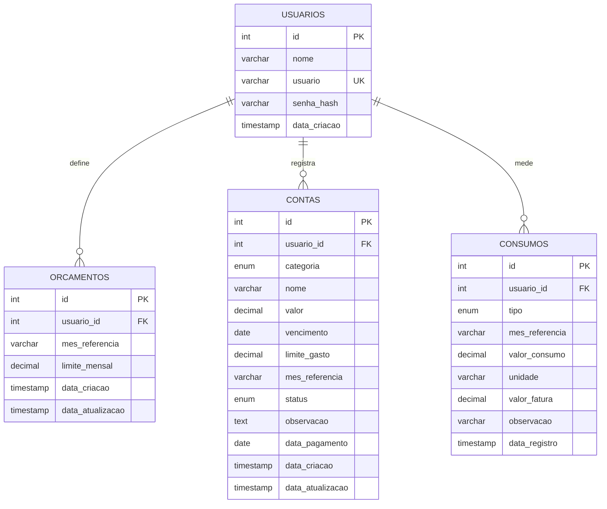

# Especificação Técnica do Sistema FLUXO (spec.md)

> **Versão:** 1.4.0  
> **Status:** Sistema Totalmente Implementado, Polido e Funcional  
> **Ambiente de Referência:** PHP 8.2+ / MySQL 10.4+ (MariaDB) / XAMPP / Apache  

---

## 1. Visão Geral

O **FLUXO** é uma aplicação web desenvolvida para apoiar pessoas e famílias no gerenciamento doméstico de despesas financeiras e no acompanhamento consciente do consumo de recursos essenciais como água e energia elétrica.

A proposta de valor do sistema reside em eliminar o atrito de planilhas complexas e ferramentas corporativas rígidas, oferecendo uma experiência acolhedora, visualmente equilibrada em atmosfera verde sálvia, com títulos objetivos e navegação fluida, respondendo instantaneamente à pergunta fundamental do morador: *"Como estão minhas contas e o consumo da minha casa este mês?"*.

---

## 2. Objetivo

O **FLUXO** tem como finalidade centralizar a gestão de contas residenciais em um único ambiente intuitivo e seguro, permitindo o controle rigoroso do orçamento mensal contra gastos imprevistos. O sistema capacita moradores e famílias a registrar medições de consumo de água e energia, identificar anomalias nas faturas antes do pagamento e tomar decisões financeiras informadas por meio de indicadores visuais claros, alertas automáticos e relatórios gráficos históricos.

---

## 3. Problema

Em muitas residências, as contas só são notadas no dia do vencimento ou do pagamento. Os moradores enfrentam dificuldades frequentes como:
- Falta de percepção sobre quanto do orçamento mensal já foi comprometido;
- Desconhecimento de quais contas ainda estão pendentes ou próximas de vencer;
- Insegurança sobre quanto ainda é possível gastar até o fim do mês;
- Dificuldade para identificar anomalias, como um aumento repentino no valor de uma conta variável;
- Falta de histórico e visão percentual sobre o aumento ou redução do consumo físico de água (litros/m³) e energia (kWh);
- Sensação de sobrecarga gerada por sistemas com estética bancária fria e excessivamente burocrática.

---

## 4. Solução

O **FLUXO** reúne em uma interface orgânica e acolhedora:
- **Painel Inicial Doméstico:** Saudação humanizada com diagnóstico em tempo real do estado financeiro do mês;
- **Hero de Orçamento Mensal:** Visualizador proeminente do teto de gastos familiar, valor comprometido, valor livre e barra de progresso com indicativo de estado (Confortável, Atenção ou Ultrapassado);
- **Avisos Contextuais Automáticos:** Notificações inteligentes que alertam sobre limites atingidos (ex.: conta de luz próxima do limite individual), vencimentos nos próximos dias e variações anormais de consumo;
- **Gestão de Contas (CRUD Completo):** Controle por categorias contextuais (Água, Energia, Internet, Aluguel, Streaming, Outras despesas), status (pendente, paga, vencida) e limites individuais opcionais;
- **Acompanhamento de Consumo:** Registro e cálculo automático da variação percentual de água e energia em relação ao mês anterior, com gráficos de linha interativos;
- **Relatórios & Gráficos:** Gráfico de distribuição por categorias (Donut), evolução mensal dos gastos e comparativo físico de recursos.

---

## 5. Usuários e Permissões

O FLUXO possui um único perfil de usuário planejado e implementado: o **Usuário Cadastrado**. Não existem perfis administrativos, de suporte ou de múltiplos níveis hierárquicos no escopo do sistema.

### Permissões do Usuário Cadastrado:
- Criar sua própria conta de acesso ao sistema e realizar login seguro;
- Consultar seu nome e identificador de usuário (`usuario`);
- Cadastrar, consultar, visualizar detalhes, editar e excluir suas próprias contas e despesas;
- Alternar o status de suas contas (marcar como paga informando data de quitação ou retornar para pendente);
- Definir e consultar tetos de orçamento mensal para qualquer mês de referência;
- Registrar medições físicas de consumo de água e energia, consultar histórico e excluir registros próprios;
- Visualizar avisos contextuais, gráficos de evolução e relatórios analíticos gerados exclusivamente a partir de seus próprios dados;
- Encerrar sua sessão de forma segura (logout).

### Garantia de Isolamento no Backend:
O isolamento dos dados é estritamente garantido pela camada de backend em todas as operações SQL. Toda e qualquer consulta de leitura, inserção, alteração ou exclusão (`SELECT`, `INSERT`, `UPDATE`, `DELETE`) nas tabelas `orcamentos`, `contas` e `consumos` inclui obrigatoriamente o filtro `WHERE usuario_id = :uid`, onde `:uid` provém da sessão autenticada (`$_SESSION['user_id']`). O sistema rejeita e neutraliza qualquer tentativa de manipulação de parâmetros por usuários que tentem forjar IDs de outros cadastros.

---

## 6. Casos de Uso Principais

| Identificador | Caso de Uso | Situação no Projeto | Descrição Resumida |
|---|---|---|---|
| **UC01** | Cadastrar usuário | Implementado | O visitante informa nome, nome de usuário único e senha confirmada para criar sua conta com senha criptografada. |
| **UC02** | Realizar login e logout | Implementado | O usuário autentica-se fornecendo nome de usuário e senha, e encerra a sessão quando desejar. |
| **UC03** | Cadastrar uma conta | Implementado | O usuário registra uma despesa informando categoria, nome, valor, vencimento, mês de referência, limite opcional e observação. |
| **UC04** | Consultar, editar e excluir contas | Implementado | O usuário lista suas contas com filtros por mês e status, acessa a tela de detalhes/edição ou remove o registro com confirmação. |
| **UC05** | Marcar uma conta como paga | Implementado | O usuário alterna o status da conta entre pendente e paga com um clique rápido, gravando a data de quitação. |
| **UC06** | Definir e consultar o orçamento mensal | Implementado | O usuário define ou reajusta o teto de gastos familiar para o mês selecionado e acompanha o saldo disponível. |
| **UC07** | Registrar consumo de água e energia | Implementado | O usuário registra a leitura física do medidor (`L`, `m³` ou `kWh`) e o valor faturado da conta do mês. |
| **UC08** | Consultar histórico e variação de consumo | Implementado | O usuário analisa a tabela histórica e os gráficos comparativos com indicação percentual de subida ou descida em relação ao mês anterior. |
| **UC09** | Consultar dashboard, avisos e relatórios | Implementado | O usuário acessa a visão geral de contas, recebe alertas contextuais proativos e avalia gráficos de distribuição e evolução financeira. |

---

## 7. Requisitos Funcionais (RF)

- **RF01:** O sistema deve permitir que uma pessoa crie uma conta de usuário informando nome, nome de usuário único (`usuario`), senha e confirmação de senha, armazenando a senha em formato de hash criptográfico. *(Implementado)*
- **RF02:** O sistema deve autenticar usuários cadastrados por meio de nome de usuário e senha válidos, rejeitando tentativas inválidas com mensagens genéricas seguras. *(Implementado)*
- **RF03:** O sistema deve permitir o encerramento da sessão ativa (logout) e bloquear o acesso direto a todas as rotas privadas quando o usuário não estiver autenticado, redirecionando para a página de login. *(Implementado)*
- **RF04:** O sistema deve permitir o cadastro de contas e despesas associadas ao usuário logado, contendo categoria, nome, valor monetário positivo, data de vencimento, mês de competência (`YYYY-MM`), limite de gasto individual opcional e observações. *(Implementado)*
- **RF05:** O sistema deve permitir a listagem filtrada de contas por mês de referência e por situação (`todos`, `pendente`, `paga`, `vencida`), exibindo somatórios e contadores de resumo. *(Implementado)*
- **RF06:** O sistema deve permitir a consulta detalhada, edição completa e exclusão definitiva de contas pertencentes exclusivamente ao usuário autenticado. *(Implementado)*
- **RF07:** O sistema deve permitir a alteração rápida de status de uma conta para `paga` (registrando a data atual de quitação) ou retorno para `pendente`. *(Implementado)*
- **RF08:** O sistema deve atualizar automaticamente para `vencida` qualquer conta pendente cuja data de vencimento seja anterior à data corrente do sistema. *(Implementado)*
- **RF09:** O sistema deve permitir a definição e atualização do teto de orçamento mensal (`limite_mensal`) para qualquer mês de referência escolhido pelo usuário. *(Implementado)*
- **RF10:** O sistema deve calcular em tempo real o total gasto comprometido, o saldo financeiro disponível e o percentual consumido do orçamento mensal. *(Implementado)*
- **RF11:** O sistema deve permitir o registro de medições de consumo de água e energia elétrica informando tipo (`Água` ou `Energia`), mês de competência, valor numérico do consumo, unidade de medida e valor faturado em reais. *(Implementado)*
- **RF12:** O sistema deve calcular automaticamente a variação percentual do consumo físico em relação ao mês anterior ($M-1$), tratando ausência de histórico e indicando aumentos ou reduções de consumo. *(Implementado)*
- **RF13:** O sistema deve exibir gráficos visuais interativos de evolução temporal de consumo e distribuição de despesas por categoria. *(Implementado)*
- **RF14:** O sistema deve gerar avisos inteligentes contextuais na página inicial quando o orçamento atingir $\ge 80\%$ ou for ultrapassado, quando contas atingirem $\ge 80\%$ do limite individual, quando houver contas vencendo nos próximos 3 dias ou vencidas, e quando o consumo subir $\ge 10\%$. *(Implementado)*
- **RF15:** O sistema deve disponibilizar relatórios mensais com detalhamento por categorias, histórico de pagamentos e comparativo de consumo. *(Implementado)*
- **RF16:** O sistema deve permitir alternar visualmente entre três temas (Verde, Claro e Escuro), persistindo a escolha no navegador do usuário. *(Implementado)*

---

## 8. Requisitos Não Funcionais (RNF)

- **RNF01 — Armazenamento Seguro de Senhas:** As senhas dos usuários nunca devem ser armazenadas em texto puro, sendo processadas exclusivamente com algoritmo de hash Bcrypt via `password_hash($senha, PASSWORD_DEFAULT)` e validadas por `password_verify()`. *(Verificado e testado)*
- **RNF02 — Validação no Servidor:** Todos os dados recebidos por requisições HTTP (GET/POST) devem ser validados e sanitizados no servidor antes de qualquer processamento ou persistência. *(Verificado e testado)*
- **RNF03 — Isolamento de Dados Multi-usuário:** O sistema deve impedir rigorosamente que um usuário visualize, modifique ou exclua registros pertencentes a outro usuário, mesmo manipulando identificadores em URLs ou formulários. *(Verificado e testado)*
- **RNF04 — Prepared Statements com PDO:** Todas as consultas e operações executadas contra o banco de dados relacional devem utilizar prepared statements nativos via PDO com binding de parâmetros, prevenindo SQL Injection. *(Verificado e testado)*
- **RNF05 — Proteção contra Ataques Web Comuns (XSS e CSRF):** O sistema deve aplicar escapamento rigoroso de saídas HTML via `htmlspecialchars()` para mitigar Cross-Site Scripting (XSS), e validar tokens criptográficos temporários (`bin2hex(random_bytes(32))`) em todos os formulários submetidos por POST contra Cross-Site Request Forgery (CSRF). *(Verificado e testado)*
- **RNF06 — Proteção de Credenciais e Segredos:** Credenciais de banco de dados e chaves sensíveis devem ser mantidas em arquivo de ambiente (`.env`) isolado e ignorado pelo controle de versão Git. *(Verificado e testado)*
- **RNF07 — Design Responsivo:** A interface deve adaptar-se harmoniosamente a diferentes resoluções e formatos de tela, incluindo desktops, tablets e smartphones, com menu drawer mobile e elementos flexíveis. *(Verificado e testado)*
- **RNF08 — Desempenho e Eficiência de Carregamento:** As páginas principais devem carregar sem latências perceptíveis em ambiente de rede local padrão, com consultas indexadas por `usuario_id`, `mes_referencia` e `vencimento`. *(Verificado e testado)*
- **RNF09 — Organização e Manutenibilidade do Código:** O código-fonte deve ser modularizado em camadas claras (`/config`, `/includes`, `/views`, `/public`, `/assets`), com separação entre lógica de negócio, autenticação e apresentação. *(Verificado e testado)*

---

## 9. Modelo de Dados e Diagrama Entidade-Relacionamento (DER)

O banco de dados oficial é o `fluxo_db`, com codificação `utf8mb4` e collation `utf8mb4_unicode_ci`.

### 9.1 Diagrama Entidade-Relacionamento (Mermaid)



### 9.2 Estrutura Detalhada das Tabelas

#### Tabela `usuarios`
Finalidade: Armazena as credenciais de acesso e a identificação de cada morador/usuário do sistema.
| Campo | Tipo | Nulo | Chave | Descrição |
|---|---|---|---|---|
| `id` | INT AUTO_INCREMENT | NÃO | PK | Identificador único do usuário |
| `nome` | VARCHAR(120) | NÃO | - | Nome completo do usuário |
| `usuario` | VARCHAR(60) | NÃO | UK | Nome de usuário único para autenticação |
| `senha_hash` | VARCHAR(255) | NÃO | - | Hash Bcrypt da senha (`password_hash`) |
| `data_criacao` | TIMESTAMP | NÃO | - | Data e hora de criação do registro |

#### Tabela `orcamentos`
Finalidade: Armazena o limite mensal planejado de gastos para cada mês de competência por usuário.
| Campo | Tipo | Nulo | Chave | Descrição |
|---|---|---|---|---|
| `id` | INT AUTO_INCREMENT | NÃO | PK | Identificador do orçamento |
| `usuario_id` | INT | NÃO | FK | Chave estrangeira para `usuarios(id)` ON DELETE CASCADE |
| `mes_referencia` | VARCHAR(7) | NÃO | UK | Mês de competência (`YYYY-MM`, ex.: `2026-10`) |
| `limite_mensal` | DECIMAL(10,2) | NÃO | - | Valor do teto de gastos estipulado em reais |
| `data_criacao` | TIMESTAMP | NÃO | - | Data do registro inicial |
| `data_atualizacao`| TIMESTAMP | NÃO | - | Data da última atualização |

> **Restrição de Integridade:** `UNIQUE KEY uk_usuario_mes (usuario_id, mes_referencia)` garante a unicidade de um único teto por mês para cada usuário.

#### Tabela `contas`
Finalidade: Armazena as contas, despesas e pagamentos domésticos de cada usuário.
| Campo | Tipo | Nulo | Chave | Descrição |
|---|---|---|---|---|
| `id` | INT AUTO_INCREMENT | NÃO | PK | Identificador único da conta |
| `usuario_id` | INT | NÃO | FK | Chave estrangeira para `usuarios(id)` ON DELETE CASCADE |
| `categoria` | ENUM | NÃO | - | `'Água'`, `'Energia'`, `'Internet'`, `'Aluguel'`, `'Streaming'`, `'Outras despesas'` |
| `nome` | VARCHAR(150) | NÃO | - | Nome ou descrição da despesa |
| `valor` | DECIMAL(10,2) | NÃO | - | Valor monetário em reais |
| `vencimento` | DATE | NÃO | IDX | Data de vencimento |
| `limite_gasto` | DECIMAL(10,2) | SIM | - | Limite individual de alerta para essa conta |
| `mes_referencia`| VARCHAR(7) | NÃO | IDX | Mês de referência no formato `YYYY-MM` |
| `status` | ENUM | NÃO | IDX | Situação atual: `'pendente'`, `'paga'`, `'vencida'` |
| `observacao` | TEXT | SIM | - | Anotações adicionais |
| `data_pagamento`| DATE | SIM | - | Data em que a conta foi quitada |
| `data_criacao` | TIMESTAMP | NÃO | - | Data e hora do cadastro |
| `data_atualizacao`| TIMESTAMP | NÃO | - | Data e hora da última alteração |

#### Tabela `consumos`
Finalidade: Armazena os lançamentos de medição física de consumo de recursos essenciais (água e energia).
| Campo | Tipo | Nulo | Chave | Descrição |
|---|---|---|---|---|
| `id` | INT AUTO_INCREMENT | NÃO | PK | Identificador da medição |
| `usuario_id` | INT | NÃO | FK | Chave estrangeira para `usuarios(id)` ON DELETE CASCADE |
| `tipo` | ENUM | NÃO | UK | Recurso medido: `'Água'` ou `'Energia'` |
| `mes_referencia`| VARCHAR(7) | NÃO | UK | Mês de competência (`YYYY-MM`) |
| `valor_consumo`| DECIMAL(10,2) | NÃO | - | Valor físico medido (ex.: `15500.00` ou `220.00`) |
| `unidade` | VARCHAR(20) | NÃO | - | Unidade de medição: `'L'`, `'m³'` ou `'kWh'` |
| `valor_fatura` | DECIMAL(10,2) | SIM | - | Valor correspondente em R$ da fatura |
| `observacao` | VARCHAR(255) | SIM | - | Anotações sobre o consumo |
| `data_registro` | TIMESTAMP | NÃO | - | Data e hora do registro |

> **Restrição de Integridade:** `UNIQUE KEY uk_usuario_tipo_mes (usuario_id, tipo, mes_referencia)` impede duplicidade de lançamento para o mesmo tipo no mesmo mês por usuário.

---

## 10. Regras de Negócio

1. **Cálculo de Orçamento Mensal:**  
   $$\text{Gasto Comprometido} = \sum \text{contas.valor do mês}$$  
   $$\text{Saldo Disponível} = \text{limite\_mensal} - \text{Gasto Comprometido}$$  
   $$\text{Percentual Utilizado} = \left(\frac{\text{Gasto Comprometido}}{\text{limite\_mensal}}\right) \times 100$$

2. **Estados do Orçamento Familiar:**
   - $\text{Percentual} < 80\%$: *Confortável* (Verde suave).
   - $80\% \le \text{Percentual} \le 100\%$: *Atenção ao Limite* (Amarelo).
   - $\text{Percentual} > 100\%$: *Orçamento Ultrapassado* (Vermelho).

3. **Limites Individuais de Despesas:**  
   Caso uma conta possua `limite_gasto > 0`, é calculado $\frac{\text{valor}}{\text{limite\_gasto}} \times 100$. Se atingir $\ge 80\%$, um aviso contextual é emitido no dashboard. Se for superior a 100%, é disparado alerta de teto estourado.

4. **Cálculo de Variação de Consumo Físico:**  
   Compara o valor do mês corrente com o mês imediatamente anterior ($M-1$):  
   $$\text{Variação} = \left(\frac{\text{Consumo Atual} - \text{Consumo Anterior}}{\text{Consumo Anterior}}\right) \times 100$$  
   Se houver aumento $\ge 10\%$, emite aviso de atenção; se houver redução $\ge 10\%$, emite mensagem de incentivo à economia.

5. **Atualização Automática de Status de Contas:**  
   Contas com status `pendente` cuja data de vencimento seja anterior à data atual do sistema (`vencimento < CURDATE()`) são automaticamente promovidas a `vencida`.

6. **Início Limpo para Novos Cadastros:**  
   Todo novo usuário cadastrado inicia com orçamento não definido (R$ 0,00), zero contas e zero medições, sem herança de dados demonstrativos.

---

## 11. Critérios de Aceite

Os cenários abaixo são formalizados no padrão **Dado que... quando... então...** e podem ser verificados de forma automatizada e manual:

### CA01 — Cadastro de Usuário
- **Dado que** o visitante está na página de cadastro (`cadastro.php`),
- **quando** preenche nome, nome de usuário inédito, senha com no mínimo 6 caracteres, confirmação idêntica e submete o formulário,
- **então** o sistema cria o usuário no banco com hash seguro, inicia a sessão e o redireciona para a página inicial com estado limpo.

### CA02 — Login com Credenciais Válidas
- **Dado que** o usuário possui conta cadastrada com nome de usuário e senha,
- **quando** submete suas credenciais válidas na página de login (`login.php`),
- **então** o sistema autentica com sucesso, regenera o ID de sessão e o encaminha para o painel principal (`dashboard.php`).

### CA03 — Recusa de Credenciais Inválidas
- **Dado que** um usuário tenta entrar no sistema,
- **quando** submete nome de usuário inexistente ou senha incorreta,
- **então** o sistema recusa a autenticação, exibe mensagem genérica de erro e não inicia sessão.

### CA04 — Bloqueio de Acesso a Páginas Privadas sem Autenticação
- **Dado que** um visitante anônimo não possui sessão ativa,
- **quando** tenta acessar diretamente qualquer página protegida (ex.: `dashboard.php`, `contas.php`, `orcamento.php`),
- **então** o sistema bloqueia o acesso e o redireciona compulsoriamente para `login.php`.

### CA05 — Cadastro e Consulta de Contas
- **Dado que** o usuário está autenticado e na tela de cadastro de contas,
- **quando** preenche categoria, nome, valor positivo, vencimento e submete o formulário com token CSRF válido,
- **então** a conta é gravada vinculada ao seu `usuario_id` e exibida na listagem do mês correspondente em `contas.php`.

### CA06 — Edição e Exclusão de Contas
- **Dado que** o usuário visualiza uma de suas contas cadastradas,
- **quando** edita seus dados ou clica para excluir confirmando o diálogo,
- **então** a conta é alterada ou removida do banco, atualizando os somatórios do mês.

### CA07 — Marcação de Conta como Paga
- **Dado que** o usuário possui uma conta com status `pendente` ou `vencida`,
- **quando** aciona o botão de alternar status para paga,
- **então** o status da conta passa para `paga` e a data de pagamento é gravada.

### CA08 — Definição do Orçamento Mensal
- **Dado que** o usuário está na página de orçamento (`orcamento.php`),
- **quando** informa um valor positivo para o limite mensal do mês de referência e salva,
- **então** o valor é persistido na tabela `orcamentos` e passa a guiar os cálculos do dashboard.

### CA09 — Cálculo Correto dos Valores Utilizados e Restantes
- **Dado que** o usuário possui um orçamento definido de R$ 1.000,00 e duas contas cadastradas somando R$ 350,00,
- **quando** visualiza o painel de orçamento ou dashboard,
- **então** o sistema exibe exatamente R$ 350,00 comprometidos, R$ 650,00 disponíveis e 35% de percentual consumido.

### CA10 — Registro e Consulta de Consumo
- **Dado que** o usuário está na página de consumo (`consumo.php`),
- **quando** cadastra a medição de água (em litros ou m³) ou de energia (em kWh) para o mês,
- **então** o registro é salvo e passa a compor a tabela histórica e os gráficos de tendência.

### CA11 — Comparação de Consumo entre Períodos
- **Dado que** o usuário possui um consumo de 200 kWh no mês anterior e registra 250 kWh no mês atual,
- **quando** consulta o painel de consumo,
- **então** o sistema exibe a variação calculada de +25% com badge visual de subida e aviso contextual.

### CA12 — Isolamento Estrito de Dados entre Dois Usuários
- **Dado que** o Usuário A cadastrou contas, orçamento e medições de consumo,
- **quando** o Usuário B acessa o sistema ou tenta requisitar registros por ID do Usuário A via GET/POST,
- **então** o Usuário B não visualiza, altera ou exclui nenhum dado do Usuário A.

### CA13 — Logout e Encerramento da Sessão
- **Dado que** o usuário está logado,
- **quando** aciona o comando de logout,
- **então** a sessão PHP é destruída, o cookie de sessão é invalidado e o usuário é redirecionado para `login.php`.

---

## 12. Stack Tecnológica e Implantação

### 12.1 Tecnologias Utilizadas no Projeto
- **Backend:** PHP 8.2 (compatível com PHP 8.0+ em modo nativo);
- **Banco de Dados:** MySQL 5.7+ / MariaDB 10.4+ com driver nativo **PDO** (`PDO::ATTR_ERRMODE => ERRMODE_EXCEPTION`, `PDO::ATTR_EMULATE_PREPARES => false`);
- **Frontend:** HTML5 semântico, CSS3 moderno (Custom Properties, Flexbox, CSS Grid) e JavaScript Vanilla sem dependência de frameworks volumosos;
- **Gráficos:** Chart.js 4.4 via CDN oficial;
- **Servidor Web Local:** Apache 2.4 integrado ao ambiente XAMPP;
- **Controle de Versão:** Git com repositório estruturado e histórico preservado.

### 12.2 Justificativa da Escolha da Stack
A combinação PHP + MySQL + Vanilla JS + CSS nativo foi selecionada estrategicamente por aliar:
- **Simplicidade de Arquitetura:** Execução sem etapas complexas de compilação ou empacotamento, permitindo avaliação acadêmica imediata;
- **Ampla Compatibilidade:** Funciona de maneira uniforme em qualquer ambiente de hospedagem web tradicional ou servidor LAMP/WAMP;
- **Alta Manutenibilidade:** Baixo acoplamento e dependências externas mínimas reduzem riscos de quebra por bibliotecas depreciadas;
- **Segurança Nativa:** Recursos consolidados de proteção em PHP (Bcrypt, PDO prepared statements, controle fino de sessões e cookies HTTPOnly).

### 12.3 Execução Local
1. Mover ou clonar a pasta do projeto para o diretório web do servidor local (ex.: `c:\xampp\htdocs\FLUXO`);
2. Iniciar os módulos **Apache** e **MySQL** no XAMPP Control Panel;
3. Criar o arquivo `.env` na raiz do projeto a partir do modelo:
   ```bash
   copy .env.example .env
   ```
4. Configurar as credenciais no `.env` (no XAMPP padrão: `DB_HOST=localhost`, `DB_NAME=fluxo_db`, `DB_USER=root`, `DB_PASS=`);
5. O provisionamento do banco e das tabelas ocorre de maneira automática no primeiro acesso via `config/database.php`;
   - Opcionalmente, pode-se importar o arquivo `database/seed.sql` caso se deseje carregar o cenário demonstrativo da usuária Alice Silva;
6. Acessar no navegador: `http://localhost/FLUXO/`.

### 12.4 Situação de Publicação / Deploy
- **Ambiente de Produção:** O destino de implantação pública remota encontra-se atualmente **pendente**.
- **Requisitos para Publicação Futura:**
  - Servidor web Linux/Apache ou Nginx com suporte a PHP 8.0+ e extensões `pdo_mysql`, `mbstring`, `session`;
  - Banco de dados relacional MySQL 5.7+ ou MariaDB 10.4+;
  - Certificado SSL ativo (HTTPS) com configuração de cookies de sessão seguros (`secure = true`);
  - Variáveis de ambiente configuradas no servidor protegendo as credenciais sem exposição pública.

---

## 13. Sistema de Temas e Identidade Visual

O FLUXO conta com três temas selecionáveis instantaneamente via segmented control, com persistência em `localStorage` (`fluxo_theme`):

1. **Modo Verde (🌿 Principal Identidade do FLUXO):**
   Toda a interface transmite uma atmosfera visivelmente verde, inspirada em sálvia, folhas e natureza:
   - Fundo geral da página: verde sálvia suave visível (`#DFECE3`);
   - Cartões e superfícies: tonalidade verde clara acolhedora (`#EBF4EE`);
   - Seções secundárias e cabeçalhos: verde suave coordenado (`#D8E8DD` e `#E8F2EC`);
   - Bordas e divisores: verde intermediário nítido (`#B5D2BF`);
   - Tipografia: verde floresta profundo (`#0F2A1D` e `#2C533F`) com excelente contraste e legibilidade;
   - Barra lateral: verde floresta denso (`#143A2A`) com contraste marcante.
2. **Modo Claro (☀️ Claro):**
   Paleta diurna tradicional e arejada com fundo `#F7FAF8`, cartões brancos `#FFFFFF` e sidebar clara.
3. **Modo Escuro (🌙 Escuro):**
   Paleta noturna com fundo florestal escuro `#111A15`, cartões em `#1B2922`, bordas `#273B30` e tipografia clara `#E7F3EC`, sem ofuscamento.

---

## 14. Limitações Conhecidas e Futuras Melhorias

### Limitações Conhecidas:
- O envio de e-mails para recuperação de senha não está acoplado a gateway SMTP externo (a redefinição de acesso é local);
- A captura de leituras de consumo é realizada por digitação manual do morador, sem integração com medidores inteligentes IoT.

### Futuras Melhorias:
- Leitor de código de barras / linha digitável de boletos bancários;
- Notificações de vencimento via webhook (Telegram / WhatsApp);
- Exportação de relatórios em PDF e planilha eletrônica (CSV/XLSX).
